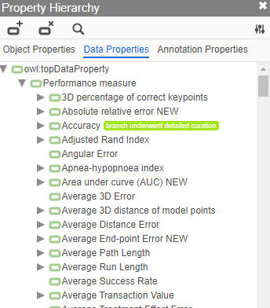

# Introducing the Intelligence Task Ontology (ITO)
## A comprehensive model of artificial intelligence and its applications

The Intelligence Task Ontology (ITO) provides a comprehensive map of artificial intelligence tasks, as well as broader human intelligence or hybrid human/machine intelligence tasks.

You can [browse ITO online at BioPortal](https://bioportal.bioontology.org/ontologies/ITO/?p=classes&conceptid=https%3A%2F%2Fai-strategies.org%2Fontology%2FProcess).

See also https://ai-strategies.org

### Examples
ITO aims to provide a richly structured hierarchy of processes, algorithms, data and performance metrics. Data on thousands of AI benchmark results have been imported from [Papers With Code](https://paperswithcode.com/) and are further curated.

An example of a benchmark result embedded in an ontological hierarchy:

Exploring the class hierarchy:

> 

Exploring the hierarchy of perfomance measures:

> 

### Current status

The ontology and associated resources are still under intense development. If you have questions or are interested in collaborations, please contact us!

### Using ITO

The ITO model is made available as an OWL (Web Ontology Language) file. You can use the [Protege ontology editor](https://protege.stanford.edu/) to explore and edit the ontology. You can use a wide variety of frameworks for OWL, RDF and the SPARQL graph query language to access and query the ontology. We recommend using the (Owlready2)[https://pythonhosted.org/Owlready2/] Python library. We will soon release notebooks demonstrating the use of Owlready2 and SPARQL with ITO.

### Licensing

The ontology file is distributed under a [CC-BY-SA](https://creativecommons.org/licenses/by-sa/4.0/) license.

ITO includes data from the Papers With Code project (https://paperswithcode.com/). Papers With Code is licensed under the CC-BY-SA license. Data from Papers With Code are partially altered (manual curation to improve ontological structure and data quality).

ITO includes data from the EDAM ontology. The EDAM ontology is licensed under a CC-BY-SA license.

We offer ITO and related resources as-is and make no representations or warranties of any kind concerning the resources, express, implied, statutory or otherwise, including without limitation warranties of title, merchantability, fitness for a particular purpose, non infringement, or the absence of latent or other defects, accuracy, or the present or absence of errors, whether or not discoverable, all to the greatest extent permissible under applicable law.

### Contact

[Samwald research group](https://samwald.info/) @ Section for Artificial Intelligence and Decision Support, Medical University of Vienna
matthias.samwald (at) meduniwien.ac.at

